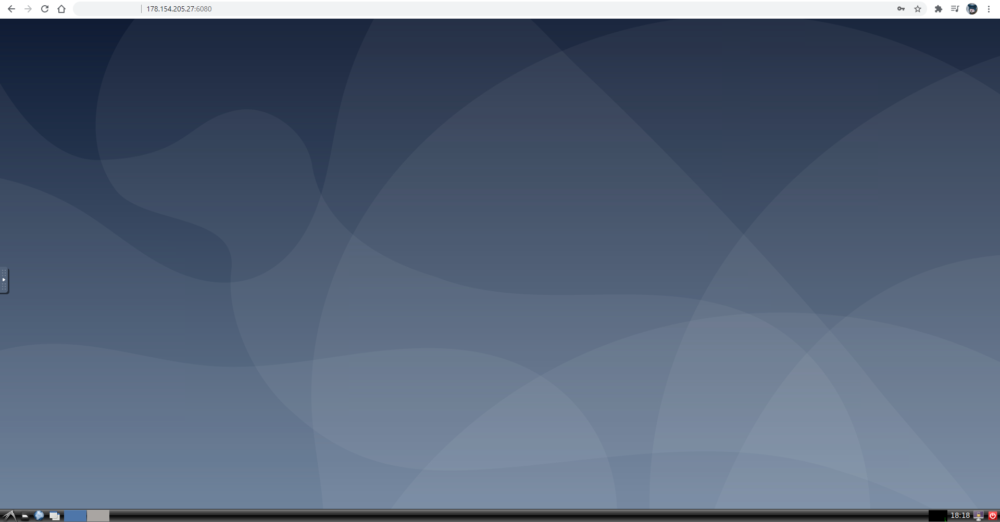

# User VM

How-to create a custom user environment and providing access to it via noVNC using Debian 10. The minimum hard drive requirement is 7 DB.


## 1. Install core packages
```bash
sudo apt-get update
sudo apt install -y lxde npm wget tightvncserver git sqlmap nmap gcc git ruby ruby-dev libcurl4-openssl-dev make zlib1g-dev libcurl4-openssl-dev libxml2 libxml2-dev libxslt1-dev ruby-dev build-essential libgmp-dev zlib1g-dev mc python-pip python3-pip dirb perl libio-socket-ssl-perl libdbd-sqlite3-perl libclass-dbi-perl libio-all-lwp-perl nginx geany libssl-dev openssl gimp php-cli cewl wfuzz ncat netcat screen
```

## 2. Setup  VNC and NoVNC

```
#Download tigerVNC to replace tightvnc 
wget https://sourceforge.net/projects/tigervnc/files/stable/1.10.1/tigervnc-1.10.1.x86_64.tar.gz/download
mv download tiger.tar.gz
tar -xzf tiger.tar.gz
rm -f tiger.tar.gz
sudo cp -r tigervnc-1.10.1.x86_64/* /
rm -rf tigervnc-1.10.1.x86_64

#Download and install noVNC
git clone https://github.com/novnc/noVNC
cd noVNC
cp vnc.html index.html
sudo cp -R /home/admin/noVNC  /usr/share/
cd ~
rm -rf noVNC
sudo chmod 777 -R /usr/share/noVNC/
```


### 3. VNC and NoVNC service configuration
VNC service - **/etc/systemd/system/vnc.service**
```
[Unit]
Description=vncserver
After=network.target
StartLimitIntervalSec=0
[Service]
Type=forking
User=admin
ExecStart=/usr/bin/env /usr/bin/vncserver
ExecStartPre=/bin/sh -c 'rm -f /home/admin/.vnc/*.log;rm -f /home/admin/.vnc/*.pid;/usr/bin/vncserver -kill %i > /dev/null 2>&1 || :'
ExecStop=/usr/bin/vncserver -kill %i
[Install]
WantedBy=multi-user.target
```


NoVNC service - **/etc/systemd/system/novnc.service**
```
[Unit]
Description=NoVNC
After=network.target
StartLimitIntervalSec=0

[Service]
Type=simple
User=admin
ExecStart=/usr/bin/env /bin/bash /usr/share/noVNC/utils/launch.sh --vnc localhost:5901

[Install]
WantedBy=multi-user.target
```

### Tuning NoVNC (additional step)

#### Remove unused buttons
Edit **/usr/share/noVNC/app/ui.js** and append to the end of the file next strings:

```
document.getElementById('noVNC_toggle_extra_keys_button').style.display='none';
document.getElementById('noVNC_fullscreen_button').style.display='none';
document.getElementById('noVNC_settings_button').style.display='none';
document.getElementById('noVNC_disconnect_button').style.display='none';
```

#### Remote scaling

In **/usr/share/noVNC/app/ui.js**  find ``` UI.initSetting('resize', 'off');``` and replace it with  ``` UI.initSetting('resize', 'remote');```


## 4. Start VNC and NoVNC
```
vncserver
#Enter password 123456 or some other. Depends on config in step 5
```

```
sudo systemctl enable vnc
sudo systemctl enable novnc
sudo systemctl start novnc
```
Append to **/home/admin/.vnc/xtartup** next line - ```startlxde &``` to start Lxde automatically.


## 5. Nginx config 

```
echo "
server {
    listen 80;
    location / {
          proxy_http_version 1.1;
          proxy_pass http://127.0.0.1:6080/?autoconnect=true&password=123456;
          proxy_set_header Upgrade $http_upgrade;
          proxy_set_header Connection "upgrade";
          proxy_read_timeout 61s;
          proxy_buffering off;
    }

}

" | sudo tee /etc/nginx/sites-enabled/default
```

## 6. Login

Login to http://IP/ and enter VNC password.





# Additional soft and configuration

### wpscan, wfuzz and Metasploit
```
sudo gem install wpscan 
pip install wfuzz
python3 -m pip install semgrep
wpscan --update
cd ~
curl https://raw.githubusercontent.com/rapid7/metasploit-omnibus/master/config/templates/metasploit-framework-wrappers/msfupdate.erb > msfinstall
chmod +x msfinstall
./msfinstall
```

### Remove unused software
```
sudo apt-get -y remove wicd deluge xscreensaver lxmusic smplayer mpv pulseaudio  pavu* clipit
sudo apt-get -y autoremove
sudo apt-get -y autoclean
sudo apt-get -y clean
```


### Install BURP

```
curl "https://portswigger.net/burp/releases/download?product=community&version=2021.5.3&type=Linux" -o burp.sh
chmod +x burp.sh
burp.sh
```


### Install VS Code
```
wget -qO- https://packages.microsoft.com/keys/microsoft.asc | gpg --dearmor > packages.microsoft.gpg
sudo install -o root -g root -m 644 packages.microsoft.gpg /etc/apt/trusted.gpg.d/
sudo sh -c 'echo "deb [arch=amd64,arm64,armhf signed-by=/etc/apt/trusted.gpg.d/packages.microsoft.gpg] https://packages.microsoft.com/repos/code stable main" > /etc/apt/sources.list.d/vscode.list'
rm -f packages.microsoft.gpg
sudo apt install apt-transport-https
sudo apt update
sudo apt install code
```

### Turn off captive portal


https://support.mozilla.org/en-US/questions/1157121

There isn't a UI checkbox for this, so...
(1) In a new tab, type or paste about:config in the address bar and press Enter/Return. Click the button promising to be careful.
(2) In the search box above the list, type or paste captiv and pause while the list is filtered
(3) Double-click the network.captive-portal-service.enabled preference to switch the value from true to false


### Install foxy-proxy и cookieeditor

### Disable annoying message box for shortcuts

Open **file manager** goto **Edit->Preferences->General->Do not ask option on executable launch**


### Clear all your actions
```bash
cd ~
history -c
echo > .bash_history
history -c
```
